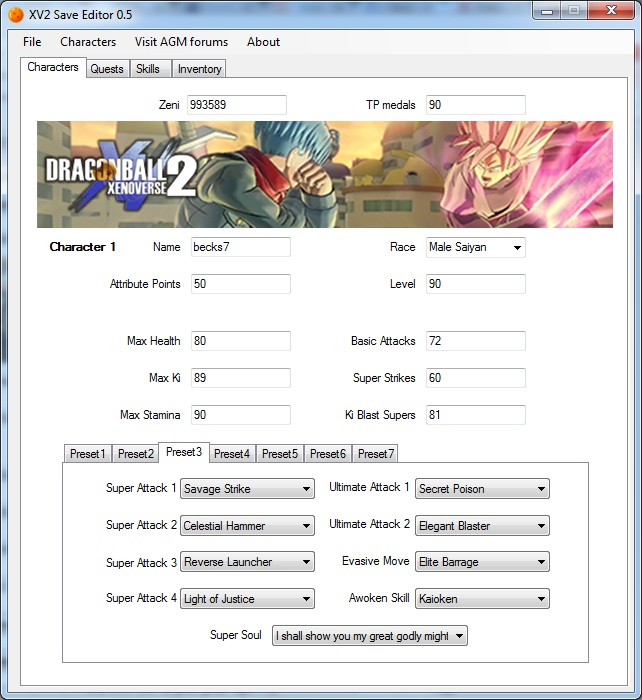

# Customizar o Dragon Ball Xenoverse 2

## Mods interessantes para se baixar

1. https://xenoversemods.com/mods/new-transformations-added-skills/ (Esse tem as trasnformações todas.. SSB, Instinto Superior, SSRose, etc etc etc..)
1. https://xenoversemods.com/mods/hisaos-hair-pack-3/
1. https://xenoversemods.com/mods/tryzicks-hair-pack-2/ (Tryzicks Two Tone Hairstyle é massa pode colocar)
1. https://xenoversemods.com/mods/tryzicks-hair-pack-17/

## Como adicionar caracteristicas de SSB no Instinto Superior

1. Acesse a pasta `C:\Program Files (x86)\Steam\steamapps\common\DB Xenoverse 2\data\chara\HUM`
1. Copie os arquivos a seguir para uma pasta separada:
	* HUM_250_Face_eye.dyt.emb
	* HUM_250_Face_eye.emb
	* HUM_250_Face_eye.emd
	* HUM_250_Face_eye.emm
	* HUM_250_Face_forehead.dyt.emb
	* HUM_250_Face_forehead.emd
	* HUM_250_Face_forehead.emm
	* HUM_250_Hair.dyt.emb
	* HUM_250_Hair.emb
	* HUM_250_Hair.emd
	* HUM_250_Hair.emm
1. Renomeie todos os arquivos trocando o número `250` por `270` e sobrescreva a pasta.
1. Para trocar a aura deve-se usar o programa `xv2skilcreat.exe` e reinstalar a skill.
1. Arquivos terminados em `.dyt.emb` guardam informação de cor
1. Os números são referentes a determinada transformação, pode-se fazer outras trocas para obter resultados esperados, conforme códigos a seguir:
	* Super Saiyan 1 = 297 (only hair will change, not eyes/face)
	* Super Saiyan 2 = 298 (only hair will change, not eyes/face)
	* Super Saiyan Rage = 238
	* Divine Potential = 248
	* Super Saiyan God = 249
	* Super Saiyan Blue = 250
	* SSB Kaioken = 251
	* SSB Kaioken X10 = 252
	* Super Saiyan Rose = 253
	* Super Saiyan 4 = 256
	* Super Vegeta 4 = 264
	* Super Kaioken = 267
	* SSB Kaioken X20 = 269
	* Ultra Instinct = 270
1. Para trocar o cabelo padrão deve-se ver o número do type escolhido na construção do personagem dentro do jogo, diminuir de 1 e adicionar os arquivos extensão `emd`, `emm` e `emd`, Exemplo de nomes de arquivos para trocar um cabelo por exemplo do type 4:
	* HUM_003_Hair.emb
	* HUM_003_Hair.emd
	* HUM_003_Hair.emm
1. É possível fazer um preview dos arquivos transformando os `emd` em arquivos `.emd.fbx`, diretamente pelo Windows 10, pelo utilitario a seguir: [download](emdfbx.exe), deve-se utilizar a seguinte sintaxe para um arquivo `HUM_003_Hair.emd`, por exemplo: `emdfbx.exe HUM_003_Hair.emd`, peça para o Windows abrir esse tipo de extensão com o programa `Mixed Reality Viewer`, e faça um preview do arquivo.

## Desabilitar o EasyAntiCheat

1. Acesse a pasta `C:\Program Files (x86)\Steam\steamapps\common\DB Xenoverse 2\EasyAntiCheat` e exclua **APENAS** o arquivo `EasyAntiCheat_x64.dll`.

## Customizar itens, atributos, dragons balls e outros do arquivo salvado

1. Baixe a última versão do `XV2 SAVE EDITOR` pelo [link](https://xenoversemods.com/mods/xv2-save-editor/)
	
1. Copie o arquivo `C:\Program Files (x86)\Steam\userdata\173358171\323470\remote\DBXV2\DBXV2.sav` (Faça backup se não quiser perder)
1. Coloque o arquivo na mesma pasta do arquivo `xv2savdec.exe` que está dentro do instalador (pasta `Save Editor 0.7.1`)
1. Arraste o arquivo `DBXV2.sav` para cima do arquivo `xv2savdec.exe`, será gerado o arquivo `DBXV2.sav.dec`
1. Abra o aplicativo `Save Editor 0.7.1\XV2 Save Editor 0.7.1\XV2 Save Editor.exe`
1. Acesse `File > Open` e abra o arquivo gerado `DBXV2.sav.dec`
1. Faça as alterações que desejar
1. Acesse `File > Save`
1. Faça o processo inverso: Arraste o arquivo `DBXV2.sav.dec` para cima do arquivo `xv2savdec.exe`, será gerado um novo arquivo `DBXV2.sav` com as alterações
1. Substitua o arquivo `C:\Program Files (x86)\Steam\userdata\173358171\323470\remote\DBXV2\DBXV2.sav` pelo arquivo gerado `DBXV2.sav`

## Instalação de mods do tipo CAC

1. Faça o download do último [Patcher](http://animegamemods.freeforums.net/thread/701/tools-eternity) & [Mod Installer](http://animegamemods.freeforums.net/thread/821/xv2-mods-installer) by eternity
1. Faça a extração do `XV2PATCHER` e copie as pastas "bin" and "XV2PATCHER" na raíz da instalação do Xenoverse `C:\Program Files (x86)\Steam\steamapps\common\DB Xenoverse 2`
1. Mod Installer pode ser executado diretamente, possui basicamente dois arquivos importantes:
	* `xv2skilcreat.exe`: Esse arquivo permite customizar Skills, por exemplo com auras de uma determinada cor, baseada em outro personagem, por exemplo: Goku SSB
	* `xv2ins.exe`: Esse é o arquivo mais importante, ele faz a instalação dos arquivos `x2m` no Jogo

